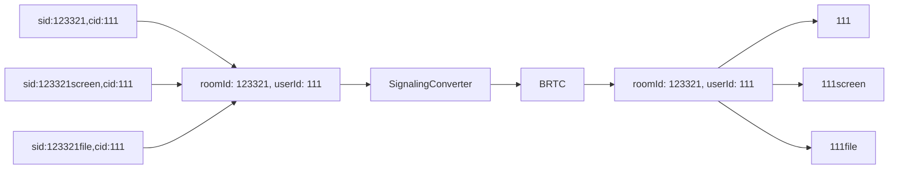
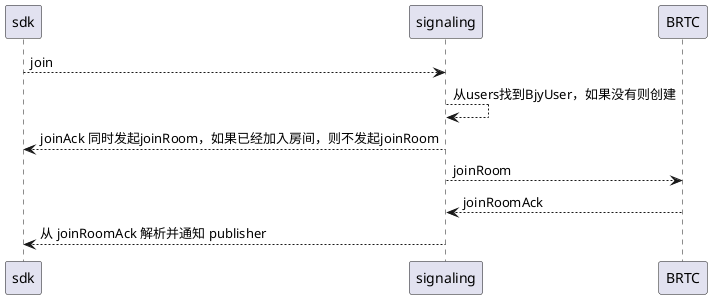

## 简介

> 百家云转换代理是百家云底层信令适配 BRTC 信令，提供了信令的基本功能，包括用户映射管理、协议转换、应用管理等

项目地址： [百家云转换代理](https://git.baijiashilian.com/cloud/BRTC/signalingconverter)

## 2. 功能特性

`SignalingConverter` 可以在客户端不升级的情况下， 将百家云的请求转发到 BRTC 房间， 从而替换百家云服务的信令功能， 将流量转移到 BRTC 服务上，继而可以下线百家云的信令服务。

### 2.1 用户映射管理

> 由于百家云客户端在使用模式上属于单链接多用户单流的设计， BRTC 的属于单链接多流的设计， 因此需要在信令层面做用户映射管理， 以便于 BRTC 服务能够正确的处理信令请求。

举例说明:

  - 百家云底层用户 sid:123321,cid:111 与 BRTC 用户 sid:123321,cid:111 之间的映射关系, 流 id 为 111
  - 百家云底层用户 sid:123321screen,cid:111 与 BRTC 用户 sid:123321,cid:111 之间的映射关系  流 id 为 111screen
  - 百家云底层用户 sid:123321file,cid:111 与 BRTC 用户 sid:123321,cid:111 之间的映射关系  流 id 为 111file

以上三个用户均来自一条 ws 链接， 但是在 BRTC 服务中， 他们同一个用户， 三个不同的流， 因此需要在信令层面做映射管理。

```go

// ParseId 解析房间id
func ParseId(roomId string) (rid string, typeName string, err error) {
    re := regexp.MustCompile(`^(\d+)(.*?)$`)
    
    // 使用正则表达式匹配字符串
    match := re.FindStringSubmatch(roomId)
    
    // 判断是否匹配成功
    if len(match) == 3 {
        // 第一个匹配项是数字
        rid = match[1]
        // 第二个匹配项是类型
        typeName = match[2]
    } else {
        err = fmt.Errorf("invalid room id")
    }
    return
}

```




### 2.2 协议转换

> 协议转换是指将百家云的信令协议转换为 BRTC 信令协议， 以便于 BRTC 服务能够正确的处理信令请求， 反向转换也是一样。

举例说明:

- 百家云信令 join 经过协议转换后， 变成了 BRTC 信令 joinRoom， 从而能够正确的加入 BRTC 房间
- 百家云信令 quit 经过协议转换后， 变成了 BRTC 信令 leaveRoom， 从而能够正确的离开 BRTC 房间

### 2.3 应用管理

> 应用管理是指管理百家云的应用信息， 以便于 BRTC 服务能够正确的 APPID, 方便进行鉴权和计费。


## 3. 实现原理

### 3.1 Entity

> 桥接用户实体， 主要用于管理用户信息， 以便于进行协议转换和用户映射管理


entity.png


### 3.2 Jsonrpc

> Jsonrpc 是百家云信令协议， 通过 Jsonrpc 协议， 可以将百家云信令转换为 BRTC 信令， 从而能够正确的处理信令请求


jsonrpc.png


## 4. 接口说明

[原本信令格式](https://ewiki.baijiashilian.com/%E7%99%BE%E5%AE%B6%E4%BA%91/bjy-webrtc%20%E6%9C%8D%E5%8A%A1%E5%99%A8%E7%AB%AF/%E4%BF%A1%E4%BB%A4%E6%A0%BC%E5%BC%8F.md)

### 4.1 上行信令

- getServers
- switchArea
- join
- quit
- publish
- unpublish
- changeMedia
- subscribe
- unsubscribe
- mute
- setPreferredLayer

### 4.2 广播信令

- publisher
- unpublish
- mediaChanged


### 4.3 时序图


- 加入房间的时序图



- 离开房间的时序图

```plantuml
sdk-->signaling: quit
signaling -->signaling : 从users找到BjyUser，则报错
signaling-->sdk: quitAck
signaling --> BRTC: leaveRoom
BRTC --> signaling: leaveRoomAck
```


### 4.4 码率映射关系

```yaml

videoLevel:
  low:
    width: 160
    height: 90
  std:
    width: 320
    height: 180
  high:
    width: 640
    height: 360
  super:
    width: 960
    height: 540
  480p:
    width: 640
    height: 480
  720p:
    width: 1280
    height: 720
  1080p:
    width: 1920
    height: 1080
bitrateMapper:
  camera:
    0-150: low
    150-300: std
    300-600: high
    600-1000: super
    1000-2000: 720p
    2000-10000: 1080p
  screen:
    0-800: 480p
    800-2000: 720p
    2000-10000: 1080p
  file:
    0-800: 480p
    800-2000: 720p
    2000-10000: 1080p

```

GET: /video?name={screen|file|camera}&bitrate=1000


```json
{
    "code": 0,
    "data": {
        "width": 1280,
        "height": 720
    },
    "msg": "success"
} 
```

测试接口地址： https://test-webrtc-signal.baijiayun.com:3100/video?name=screen&bitrate=1000 

name 可选的类型

- screen 屏幕分享  
- file 文件播放 
- camera 摄像头

bitrate 为码率或者 

- sdp 中 b=AS:xxx 数值

未找到匹配的数值时

- 会自动调整为 480p 分辨率

## 5. 部署指南


目前线上部署节点为 [北京](https://kube-admin)， 上海， 香港

