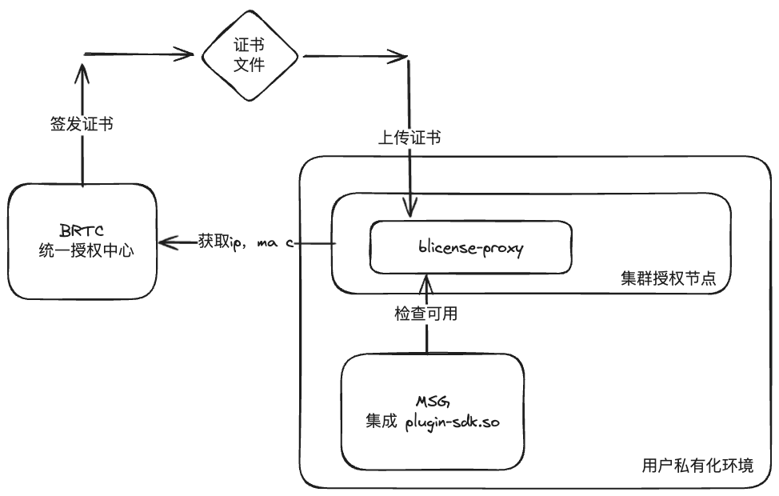
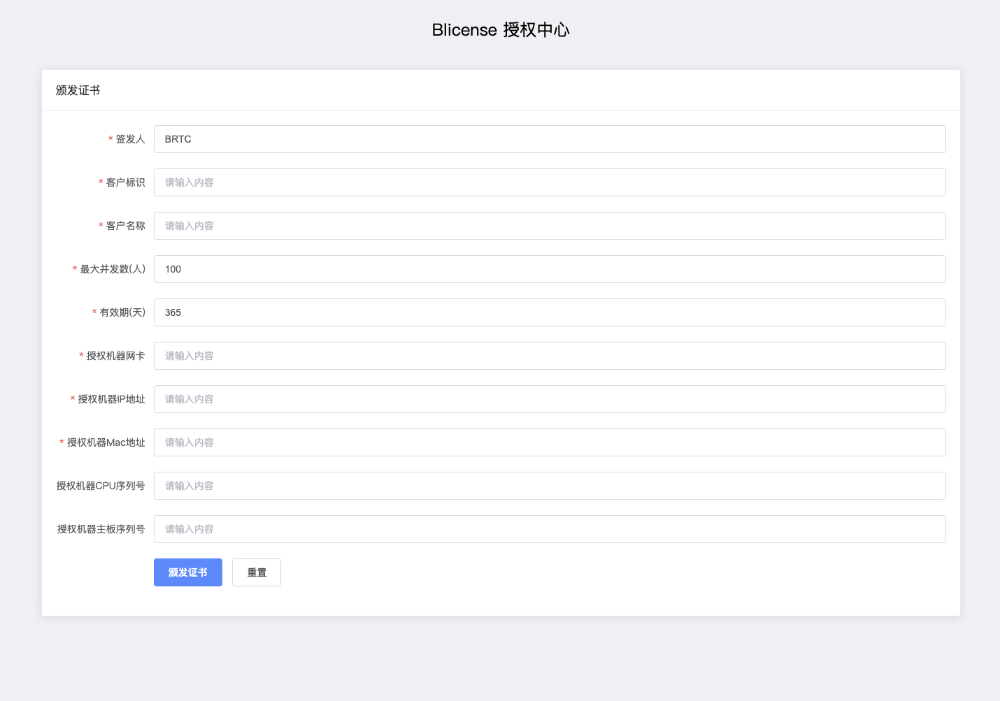
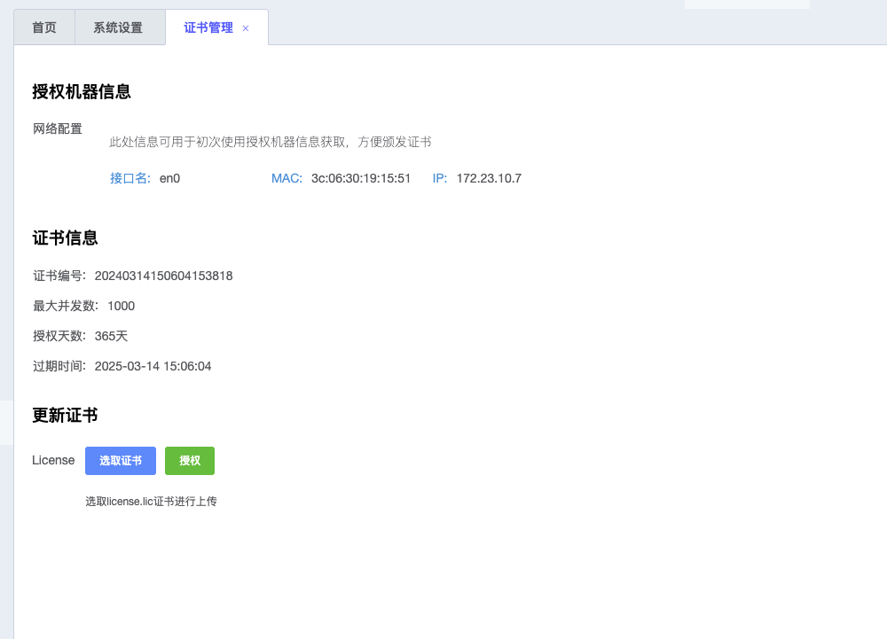

## 简介

> Blicense 是BRTC平台在私有化的时候部署的权限认证服务， 主要用于对授权用户进行约束，授权时间和授权的方数进行限制。



## 部署


### 统一签发服务端部署


```shell

./blicense server -p 8080

```

自带的签发页面



### 客户授权代理


```shell

./blicense proxy -p 8090

```

客户侧使用证书的页面


## 集成


```go

package fsevent
import (
	"context"
	"fmt"
	"github.com/spf13/cast"
	"io"
	"os/exec"
	"strings"
	"syscall"
)
type Event struct {
	exec string
	args []string
	cmd  *exec.Cmd
	ctx  context.Context
	in   io.WriteCloser
	out  io.ReadCloser
}
func NewEvent(ctx context.Context, exec string, args ...string) (*Event, error) {
	e := &Event{
		exec: exec,
		ctx:  ctx,
		args: args,
	}
	err := e.Start()
	if err != nil {
		return nil, err
	}
	return e, nil
}
func (e *Event) Start() error {
	e.cmd = exec.Command(e.exec, e.args...)
	e.cmd.SysProcAttr = &syscall.SysProcAttr{Setpgid: true}
	// 设置子进程的标准输出
	stdout, err := e.cmd.StdoutPipe()
	if err != nil {
		return err
	}
	e.out = stdout
	// 设置子进程的标准输入
	stdin, err := e.cmd.StdinPipe()
	if err != nil {
		return err
	}
	e.in = stdin
	err = e.cmd.Start()
	if err != nil {
		return err
	}
	return nil
}
func (e *Event) Shutup() error {
	err := e.cmd.Wait()
	if err != nil {
		fmt.Println("Error waiting for child process:", err)
		return err
	}
	// out
	_ = e.in.Close()
	// in
	_ = e.in.Close()
	pgid, err := syscall.Getpgid(e.cmd.Process.Pid)
	if err == nil {
		syscall.Kill(-pgid, syscall.SIGTERM)
	}
	return nil
}
func (e *Event) Valid(count int) (int, string) {
	msg := fmt.Sprintf("%d\n", count)
	_, err := e.in.Write([]byte(msg))
	if err != nil {
		return -1, "write msg failed"
	}
	// 读取子进程返回的消息
	body := make([]byte, 1024)
	l, err := e.out.Read(body)
	body = body[:l]
	if err != nil {
		return -2, "read msg failed"
	}
	return e.processMsg(body)
}
// processMsg 处理消息
func (e *Event) processMsg(body []byte) (int, string) {
	// RET:code#msg
	resp := strings.Trim(string(body), "\n")
	if strings.HasPrefix(resp, "RET") {
		return e.parseRet(resp)
	}
	return -1, "unknown error"
}
// parseRet 解析消息
func (e *Event) parseRet(resp string) (int, string) {
	// RET:code#msg
	resp = strings.TrimLeft(resp, "RET:")
	// code#msg
	splitStr := strings.Split(resp, "#")
	if len(splitStr) != 2 {
		return -1, "invalid response"
	}
	retCode := strings.Split(resp, "#")[0]
	msg := strings.Split(resp, "#")[1]
	return cast.ToInt(retCode), msg
}

```

```go

package main
import (
	"blicense/pkg/fsevent"
	"context"
	"fmt"
)
func main() {
	event, err := fsevent.NewEvent(context.Background(), "./sdk", "--api=http://localhost:2311")
	if err != nil {
		fmt.Println(err)
		return
	}
	for i := 0; i < 10; i++ {
		code, msg := event.Valid(100)
		fmt.Println(code, msg)
	}
	select {}
}

```


### 集成编译镜像

```shell
cd msg

./dockerbuild.sh -f=Dockerfile.license -t=image-tag

./dockerbuild.sh -f=Dockerfile.license -t=image-tag -p

```

```shell

./dockerbuild.sh -f=Dockerfile.license.arm -t=image-tag

./dockerbuild.sh -f=Dockerfile.license.arm -t=image-tag -p

```


### 测试环境


#### 1. 签发端

地址： [Blicense授权中心](http://10.16.30.65:31332/)

#### 2. 客户授权端

地址: [BRTC-Monitor](http://10.16.30.65:30642/)

#### 3. 客户集成测试

地址：[Site Unreachable](https://10.16.30.65:32006/)
